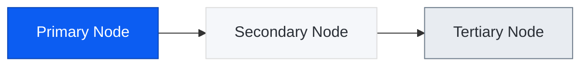

# CLAUDE.md

This file provides guidance to Claude Code (claude.ai/code) when working with code in this repository.

## Overview

This is a Jekyll-based personal website for Julietta Yaunches, hosted on GitHub Pages at yaunch.io. The site uses the "Index" theme from JekyllThemes.io.

## Common Commands

```bash
# Install dependencies
bundle install

# Run local development server
jekyll serve
# or
bundle exec jekyll serve

# Build the site (outputs to _site/)
jekyll build
```

## Content Architecture

### Collections (defined in _config.yml)

The site uses Jekyll collections for different content types:

- **_posts/** - Blog posts, rendered at `/blog/:slug`
- **_projects/** - Featured projects (uses symlinks to posts for homepage display), rendered at `/project/:slug`
- **_speaking/** - Speaking engagements, rendered at `/speaking/:slug`
- **_brooklyn_swift/** - Brooklyn Swift meetup events, rendered at `/brooklyn_swift/:slug`
- **_pages/** - Static pages (about, contact, thanks), rendered at `/:name`

### Front Matter Structure

Posts use this front matter pattern:
```yaml
---
title: 'Post Title'
subtitle: Article
date: YYYY-MM-DD
description: Brief description for meta tags and previews
featured_image: '/images/folder/image.png'
---
```

### Projects Collection

The `_projects/` folder contains symlinks to posts that should appear as featured projects on the homepage. To feature a post as a project, create a symlink in `_projects/` pointing to the post file.

## Layout Hierarchy

- `default.html` - Base layout with header, sidebar, and main content area
- `post.html` - Blog posts (extends default via about_item)
- `project.html` - Projects and speaking entries (extends default via about_item)
- `page.html` - Static pages (extends default via about_item)
- `category.html` - Category listing pages

## Configuration Files

- **_config.yml** - Jekyll configuration, collections, permalinks, plugins
- **_data/settings.yml** - Theme settings (colors, fonts, menu, social links, contact form)

## Blog Ideation Workflow

The repository includes a custom Claude Code command at `.claude/commands/blog-ideation.md` for developing blog post ideas through multi-persona feedback. Run with `/blog-ideation [idea summary]`.

Ideation workflow outputs go to `drafts/[blog-title-slug]/` with research files and persona feedback.

Personas are defined in `.claude/personas/` (Karpathy, Graham, Fowler, Taylor).

## Images

Store images in `/images/` organized by post or feature:
- `/images/[post-slug]/` - Images for a specific post
- Post images should be referenced with absolute paths: `/images/folder/image.png`

## Mermaid Diagrams

The site uses mermaid.js for diagrams (configured in `_includes/mermaid.html`).

**To enable Mermaid on a page, add to front matter:**
```yaml
---
mermaid: true
---
```

When creating mermaid diagrams in markdown files, use this color scheme for consistency:

```
Primary (accent blue):   fill:#0C5DF2, color:#ffffff, stroke:#0945b5
Secondary (light):       fill:#F5F7FA, color:#2A2F36, stroke:#dddddd
Tertiary (subtle gray):  fill:#e8ecf1, color:#2A2F36, stroke:#6C7A89
```

**Example usage in flowcharts:**


**Guidelines:**
- Use Primary (blue) for key/highlighted elements
- Use Secondary (light) for standard nodes
- Use Tertiary (gray) for supporting/background elements
- Text color is `#2A2F36` (dark gray) except on Primary which uses white
- Do NOT use custom pastel colors - stick to the site theme
