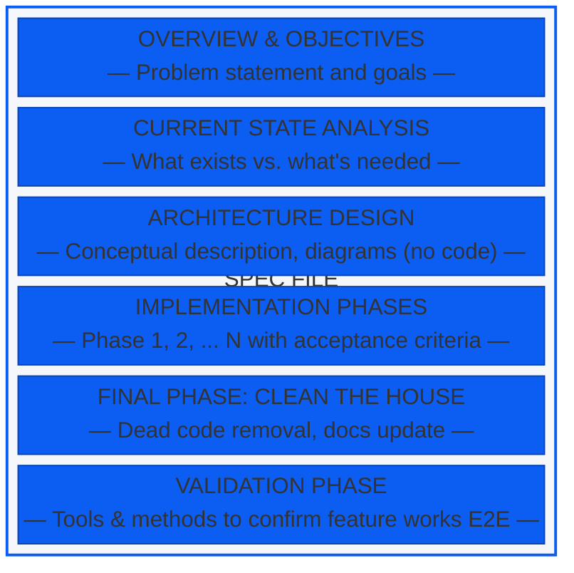
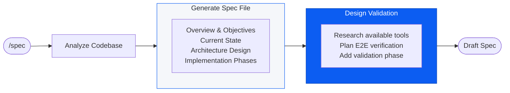
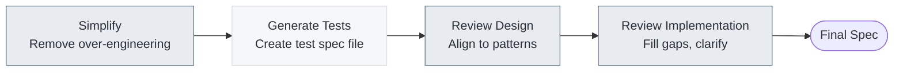
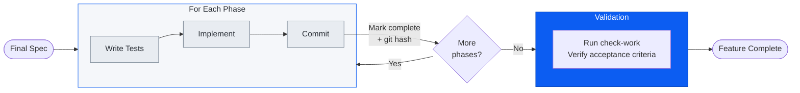
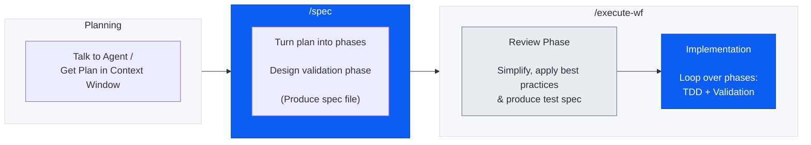

Verification-driven means defining up front what the agent must get right—and spending the time to articulate what 'right' looks like. Architecture alignment. Codebase patterns. Simplicity. Test coverage. These are tunable criteria, not a fixed list. The point is that *you* define what to verify, and the agent iterates until those criteria are met. The workflows I'll present apply this principle across planning and implementation, turning your definition of 'right' into checkpoints the agent can verify against.

The insight underneath is simple: **verifiable tasks are automatable tasks.** This is the same mechanism behind RLVR (Reinforcement Learning from Verifiable Rewards) that drove the reasoning capabilities of o1 and o3. Tests are resettable, efficient, and provide non-gameable reward signals. Give the model a verification target and let it practice.

---

## The Spec File

The spec file is where your definition of "right" becomes structure. It's the artifact that bridges planning and execution—objectives, phases, acceptance criteria, validation strategy. When the context window refreshes or the agent restarts, it picks up where it left off.

But the spec file isn't just input to verification—it's subject to it. The workflows I'll present include a review phase that verifies the plan itself: Does it align with codebase patterns? Is it over-engineered? Does the test coverage match your standards? The agent iterates on the spec until these criteria are met, *before* implementation begins.

Here's how mine are structured:

---

## The Workflows

Two workflows encode the verification principle: one for planning, one for implementation.

1. **Spec Planning** — Takes a plan and produces a structured spec file with phases, acceptance criteria, and a validation strategy. The output is verifiable structure.

2. **Review and Implementation** — Verifies the spec against your standards (simplicity, patterns, test coverage), then executes it phase-by-phase using TDD. Each phase has its own verification gate.

Let's walk through each.

### Workflow 1: Spec Planning

Three steps:

1. **Plan** — Develop the plan conversationally with your agent. The goal is a coherent plan in the context window before formalizing it.

2. **Structure** — Transform the plan into a spec file with discrete phases, each with acceptance criteria. This is where your definition of "right" becomes verifiable structure.

3. **Design Validation** — Define how you'll verify the feature works end-to-end. The agent examines available tools (CLIs, MCPs, Playwright, etc.) and designs a validation phase that programmatically confirms the job is done.

The output is a draft spec—verifiable structure ready for review.

#### Workflow 1 Flowchart

---

### Workflow 2: Review and Implementation

This workflow has two sub-workflows.

#### Sub-workflow 2a: Review and Refinement

This phase verifies the spec itself. The agent iterates on the plan, checking against the criteria I've defined as important to my workflow:

- Over-engineering
- Inconsistency with codebase patterns
- Vague or incomplete test coverage
- Unnecessary backward compatibility
- Deviation from project practices

Each check is a verification loop—the agent reviews, suggests changes, and refines until criteria are met. A PATTERNS.md document encodes your standards, giving the agent explicit rules to verify against.

#### A Review Loop Over the Spec

*PATTERNS.md guides: Simplify, Review Design, Review Implementation*

The output is your final spec, verified against your standards before implementation begins.

#### Sub-workflow 2b: Implementation

Implementation is a loop over phases, using TDD as the verification signal.

For each phase:
1. Write tests (the verification criteria)
2. Implement until tests pass
3. Commit and record the git hash in the spec

The git hash serves as a checkpoint—if context resets, the agent knows where to resume.

The final validation phase is another verification loop. The agent uses whatever tools match the task—Playwright for UI, CLI calls for APIs, job monitors for CI—and iterates until validation criteria are met.

---

## The Takeaway

I've used this workflow to build a personal budgeting app—a project with complex integrations across multiple third-party services. The codebase has 98% unit test coverage on human-confirmed test cases, plus a suite of validation tests derived from the specs that created it. Those validation tests run via Playwright and can be executed at any time to verify the feature set still works.

That's the point: the verification artifacts *are* the evidence. The test coverage, the validation suite, the spec files—they're not just process overhead. They're how you know the system did what you asked.

---

## Full Pipeline Overview

Bird's-eye view of the entire system:

