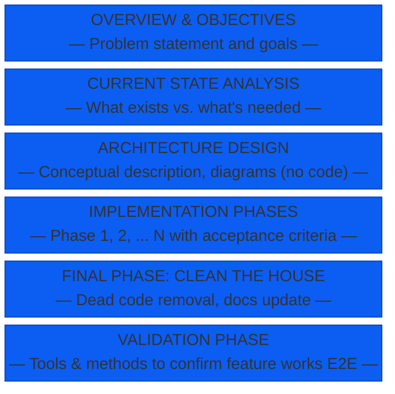
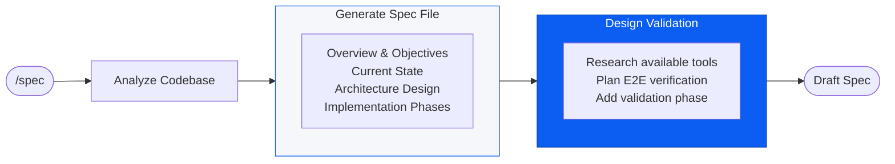
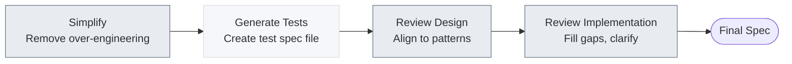
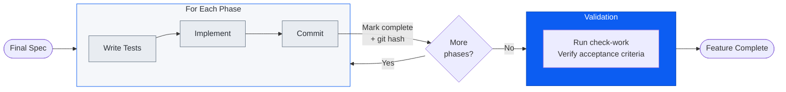

Today, I am introducing the concept of verification-driven agentic workflows. The approach: define (and continually refine) verification criteria across the entire lifecycle of a workflow, then let the agent iterate until those criteria are met. Checking in as the human at the points that you deem reasonable.

The insight underneath is simple: **verifiable tasks are automatable tasks**. This is a distillation of an [original idea](https://karpathy.bearblog.dev/verifiability/) from Andrej Karpathy on his idea of Software 2.0. It is also inherits from RLVR (Reinforcement Learning from Verifiable Rewards)—the approach that's driven the recent wave of reasoning models. Tests are resettable, efficient, and provide non-gameable reward signals. Give the model a verification target and let it practice.

## From Principle to Practice

The rest of this article walks through an example of how to put this into practice when using an agentic coding harness to write software features. I'll show this by speaking to a set of workflows that I have designed and refined over recent months. 

The approach uses two workflows: one that transforms a plan into a structured, verifiable spec; and one that reviews that spec against your standards, then implements it phase-by-phase using TDD. Both workflows use verification loops to ensure the best practices I find important are applied throughout the work that is done. 

I've packaged these as a [Claude Code plugin](https://github.com/jyaunches/vd_workflow) with two main commands: `/spec` creates the specification with phases, acceptance criteria, and a validation strategy; `/execute-wf` runs the review and implementation loops. The plugin, the spec file structure, and the verification criteria are all tunable—what follows is how I've configured mine.

The sections that follow break down each piece: 
* The spec file structure that encodes verification criteria
* The review workflow that verifies the plan
* The implementation workflow that uses [TDD as the verification signal](#appendix){:.js-no-ajax} for each phase.

These are tuned to my engineering practices—simplicity, architectural consistency, test coverage. Yours might emphasize different things. [See the appendix](#appendix){:.js-no-ajax} for more on what I verify and how a different team might configure theirs.

---

## The Spec File

The spec file is where your definition of "right" becomes structure. It's the artifact that bridges planning and execution—objectives, phases, acceptance criteria, validation strategy. When the context window refreshes or the agent restarts, it picks up where it left off.

But the spec file isn't just input to verification—it's subject to it. The workflows I'll present include a review phase that verifies the plan itself: Does it align with codebase patterns? Is it over-engineered? Does the test coverage match your standards? The agent iterates on the spec until these criteria are met, *before* implementation begins.

Here's how mine are structured:

---

## The Workflows

Two workflows encode the verification principle: one for planning, one for implementation.

1. **Spec Planning** — Takes a plan and produces a structured spec file with phases, acceptance criteria, and a validation strategy. The output is verifiable structure.

2. **Review and Implementation** — Verifies the spec against your standards (simplicity, patterns, test coverage), then executes it phase-by-phase using TDD. Each phase has its own verification gate.

Let's walk through each.

### Workflow 1: Spec Planning

Three steps:

1. **Plan** — Develop the plan conversationally with your agent. The goal is a coherent plan in the context window before formalizing it.

2. **Structure** — Transform the plan into a spec file with discrete phases, each with acceptance criteria. This is where your definition of "right" becomes verifiable structure.

3. **Design Validation** — Define how you'll verify the feature works end-to-end. The agent examines available tools (CLIs, MCPs, Playwright, etc.) and designs a validation phase that programmatically confirms the job is done.

The output is a draft spec—verifiable structure ready for review.

#### Workflow 1 Flowchart

---

### Workflow 2: Review and Implementation

This workflow has two sub-workflows.

#### Sub-workflow 2a: Review and Refinement

This phase verifies the spec itself. The agent iterates on the plan, checking against the criteria I've defined as important to my workflow:

- Over-engineering
- Inconsistency with codebase patterns
- Vague or incomplete test coverage
- Unnecessary backward compatibility
- Deviation from project practices

Each check is a verification loop—the agent reviews, suggests changes, and refines until criteria are met. A PATTERNS.md document encodes your standards, giving the agent explicit rules to verify against.

#### A Review Loop Over the Spec

*PATTERNS.md guides: Simplify, Review Design, Review Implementation*

The output is your final spec, verified against your standards before implementation begins.

#### Sub-workflow 2b: Implementation

Implementation is a loop over phases, using TDD as the verification signal.

For each phase:
1. Write tests (the verification criteria)
2. Implement until tests pass
3. Commit and record the git hash in the spec

The git hash serves as a checkpoint—if context resets, the agent knows where to resume.

The final validation phase is another verification loop. The agent uses whatever tools match the task—Playwright for UI, CLI calls for APIs, job monitors for CI—and iterates until validation criteria are met.

---

## One Application

I've used this workflow to build a few personal applications of ranging complexity (Future posts coming on these perhaps!). These codebases have extremely high unit test coverage on human-confirmed test cases, plus suites of validation tests derived from the specs that created them. Those validation tests run via Playwright and can be executed at any time to verify respective feature sets still works.

## The Take-away

Bringing it back to the original concept: this is RLVR (Reinforcement Learning from Verifiable Rewards) for your agentic workflow. The workflows I've presented define the reward signal—acceptance criteria, passing tests, validation checks—and let the agent iterate until it meets them.

The underlying insight remains: **verifiable tasks are automatable tasks.** The more precisely you can define "done," the more confidently you can hand the loop to an agent. 

---

## Appendix

### On TDD

In the agentic context, TDD serves a crucial additional purpose: it provides an objective, programmatic signal for whether a phase is complete. The agent writes tests first, confirms they fail, implements until they pass, then moves on. No ambiguity, no drift—the tests are the contract. This grounds the loop in something verifiable rather than relying on the agent's self-assessment.

---

### Tuning Your Verification Criteria

The workflows in this article verify against criteria I've found valuable over 20 years of engineering practice:

**What I verify:**
- **Simplicity** — No over-engineering, no speculative abstractions, YAGNI enforced
- **Architectural consistency** — New code follows existing patterns, no parallel systems
- **Test coverage** — Unit tests for each phase, validation tests for the feature
- **No backward compatibility hacks** — Direct integration, no shims or feature flags unless explicitly needed
- **Clean documentation** — README and CLAUDE.md stay current with changes

**What a different team might emphasize:**
- **Security-first** — Verify authentication patterns, input validation, secrets handling at every phase
- **Performance** — Verify latency budgets, query efficiency, caching strategies
- **Accessibility** — Verify WCAG compliance, screen reader compatibility, keyboard navigation
- **Compliance** — Verify audit logging, data retention policies, regulatory requirements
- **API stability** — Verify backward compatibility (the opposite of my preference), versioning, deprecation patterns

The point isn't that my criteria are right—it's that you define yours explicitly, encode them into your verification loop (in this example, that's the PATTERNS.md), and let the agent verify against them. The workflow is the same; the verification targets are yours to choose.
