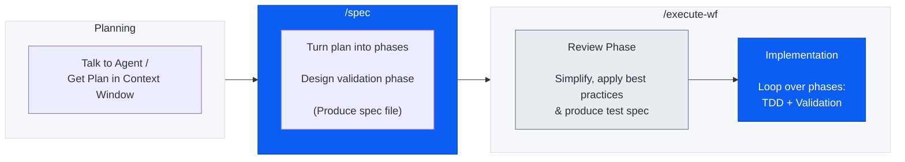
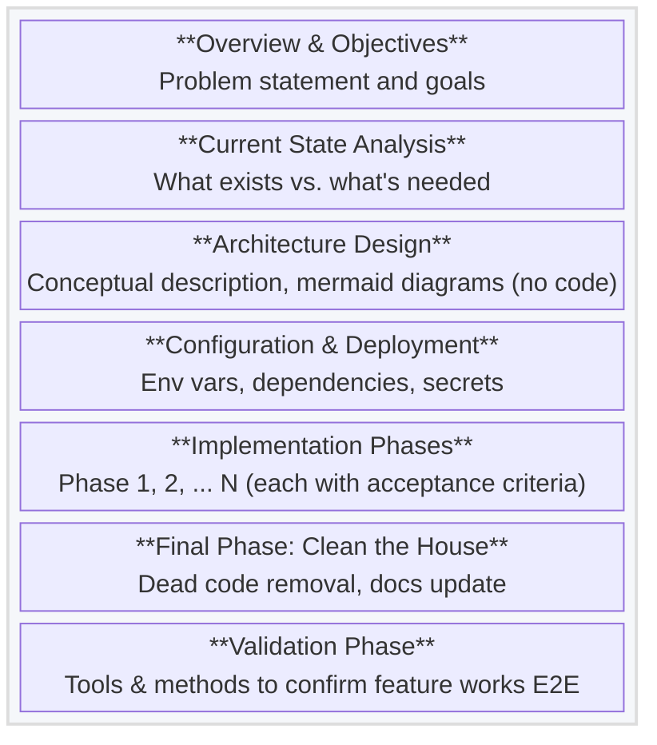
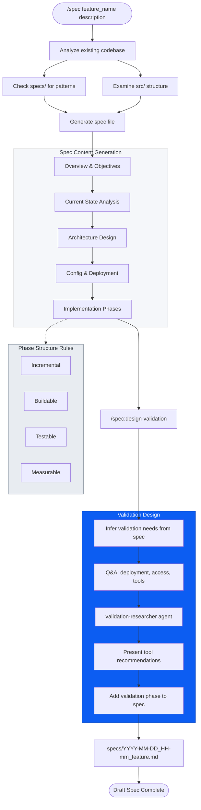
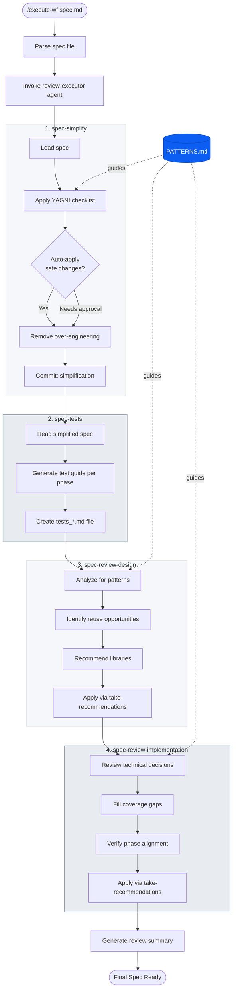
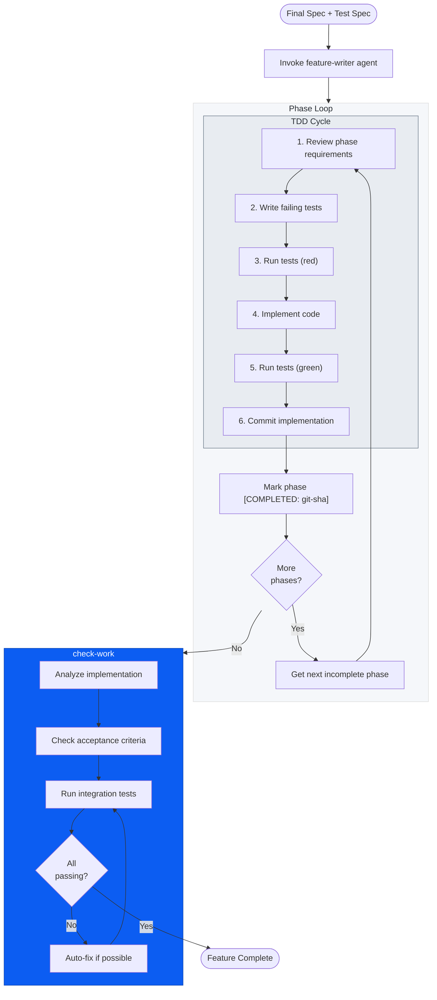

# Diagram Proposals for Article

Based on the cc_workflow_tools research, here are proposed updated diagrams that match the actual implementation.

---

## 1. Full Pipeline Overview

Simplified bird's-eye view showing the complete flow from planning to feature completion.

---

## 2. Spec File Structure

Updated to match actual spec structure from the plugin.

---

## 3. Workflow 1: Spec Creation (/spec)

Detailed flow matching actual command behavior.

---

## 4. Workflow 2a: Review Phase

The review-executor agent running four sub-commands in sequence.

---

## 5. Workflow 2b: Implementation Phase

The feature-writer agent implementing phases via TDD.

---

## 6. Spec Evolution Through Pipeline

State diagram showing how spec transforms.

```mermaid
stateDiagram-v2
    direction LR

    [*] --> Draft: /spec

    Draft: Draft Spec
    Draft: Full architecture
    Draft: All phases defined
    Draft: Validation phase added

    Draft --> Simplified: spec-simplify

    Simplified: Simplified Spec
    Simplified: YAGNI applied
    Simplified: Over-engineering removed

    Simplified --> WithTests: spec-tests

    WithTests: + Test Spec Created
    WithTests: Test guides per phase
    WithTests: Fixtures defined

    WithTests --> DesignReviewed: spec-review-design

    DesignReviewed: Design Reviewed
    DesignReviewed: Pythonic patterns
    DesignReviewed: Reuse applied

    DesignReviewed --> ImplReviewed: spec-review-implementation

    ImplReviewed: Implementation Ready
    ImplReviewed: Decisions made
    ImplReviewed: Gaps filled

    ImplReviewed --> Implementing: feature-writer

    Implementing: Implementing
    Implementing: TDD per phase
    Implementing: [COMPLETED: sha] markers

    Implementing --> Validated: check-work

    Validated: Validated
    Validated: Acceptance criteria met
    Validated: Tests passing

    Validated --> [*]: Done
```

---

## Summary of Changes from Original

| Original | Proposed | Why |
|----------|----------|-----|
| Generic "Plan Mode" | `/spec` command | Matches actual tool |
| "Generate Spec File" | Detailed spec content sections | Shows actual structure |
| "Design Validation" | `/spec:design-validation` + `validation-researcher` | Accurate flow |
| "Review Phase 1/2/3" | `spec-simplify`, `spec-tests`, `spec-review-design`, `spec-review-implementation` | Actual sub-commands |
| Generic "PATTERNS.md guides" | PATTERNS.md connected to specific steps | Shows where it's used |
| "TDD loop" | 6-step TDD cycle with git-sha marking | Matches implement-phase |
| No validation detail | `check-work` with auto-fix loop | Shows actual behavior |
| 2 agents implied | `review-executor` + `feature-writer` explicit | Accurate architecture |
