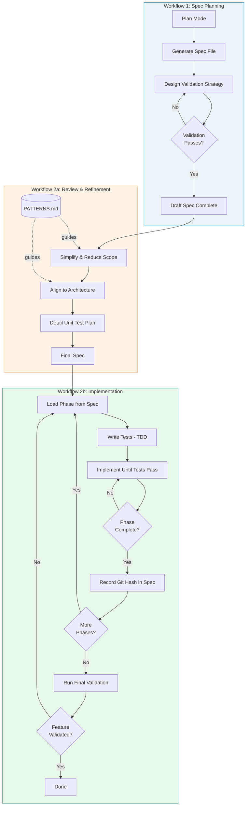
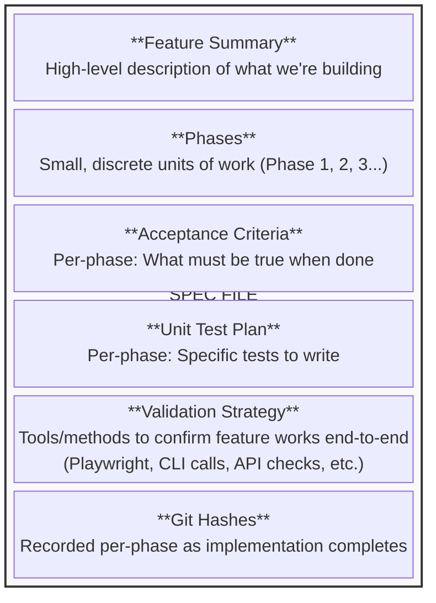
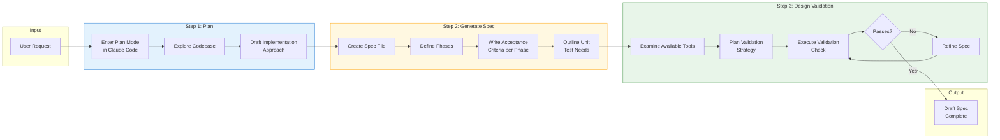
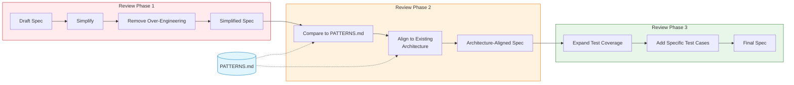

# Article Outline: Practical Agentic Coding

## Full Pipeline Overview

Bird's-eye view of the entire system:

---

## The Landscape

There's been a lot of buzz recently around two agentic coding concepts. One is the Ralph Wiggum pattern of coding loops. The other—maybe not quite as widely known but representative of an opposite end of the spectrum on patterns of automated agentic coding—is Gas Town.

---

## The Motivation

I wanted to share my version of this because it's rooted in the engineering practices that have become the foundation of my personal engineering approach over the years:

1. Consistent architecture
2. Simple solutions first
3. Acceptance tests driving feature development
4. Test-driven development

---

## The Challenge

Coding agents, without clear instructions, will NOT give you the above. Many working with a coding agent over the last 6-10 months have experimented with how to address this. You can add instructions to your CLAUDE.md or agent.md. But for me, I always found the challenge of the context window filling up and having these get lost or misunderstood within whatever stage of development we were in.

Like many people, I turned to working on specs. This is essentially a planning stage where you build out the plan for the work you are going to do.

### Spec File Structure

Over 2025, I went from working on specs to working on two distinct workflows that take you through spec planning and then through feature implementation, in a way that is grounded in some of the strongest engineering practices that I've learned over my career.

---

## Workflow 1: Spec Planning

The spec workflow is not that complicated. This is the flow:

1. **Use plan mode within Claude Code to come up with a plan.**

2. **Pipe that plan into a spec file of a certain format.** This format is important because it is going to clearly define small, discrete phases of work with acceptance criteria and unit testing needs.

3. **Design a final validation phase.** Once the spec file is written, this workflow enters the next step of designing a final validation phase. This is one of the more recent developments added and it is pretty interesting because it examines the tools it has available (CLIs, MCPs, bash, etc.) to put together a plan to 100% confirm the job is done. One great example here is (if the feature involves a frontend change to a website) using bash to start the server on localhost and then using Playwright to actually go and check the feature is there and working. If there are any issues, the process loops around addressing what's broken. This looping continues until the acceptance criteria for what should be on this page are met.

Now you have a first draft of your implementation plan.

### Workflow 1 Flowchart

---

## Workflow 2: Review and Implementation

This workflow has two sub-workflows.

### Sub-workflow 2a: Review and Refinement

The first is about reviewing, simplifying, aligning to existing architecture, and producing a more detailed unit test plan. Let me highlight again what it addresses:

**Problems it addresses:**
- Over-engineered initial specs
- Inconsistency with existing codebase patterns
- Vague or incomplete test coverage
- Scope creep in phase definitions

**Improvements it makes:**
- Reduces complexity to simplest viable solution
- Aligns naming, structure, and patterns to existing architecture
- Produces specific, actionable unit test cases
- Tightens acceptance criteria

In my implementation, this is a series of commands that I used to run independently and review the suggestions very closely. After a lot of refinement, I moved to just letting these go through with auto-approval, having them refer to a PATTERNS reference document that contained explicit callouts to our design principles and any firm rules for how to make decisions. I realize this would raise a lot of eyebrows out there for many people, but I have to say I've been quite happy with the outcomes.

### Spec Transformation Through Review

At this point you have your final spec files. You can review them before proceeding to implementation. (I have actually stopped doing this.)

### Sub-workflow 2b: Implementation

The second is the actual implementation.

At this point you have two detailed spec files. One for the feature implementation details along with phase-level acceptance criteria, and overall feature validation (validation planned should use a tool to actually go and look at what this feature produces and confirm it is delivering said promise—go to a webpage, call a CLI or API, monitor a GitHub job, whatever it is).

Now we are primed for a well-informed, grounded Ralph Wiggum-type loop to run for us. This phase of the process takes the finite defined phases of the spec and literally loops through them using TDD.

> **On TDD**: Test-driven development has been a cornerstone of quality software engineering for decades. In the agentic context, TDD serves a crucial additional purpose: it provides an objective, programmatic signal for whether a phase is complete. The agent writes tests first, confirms they fail, implements until they pass, then moves on. No ambiguity, no drift—the tests are the contract. This grounds the loop in something verifiable rather than relying on the agent's self-assessment.

One additional callout is that as these phases are getting looped through, when work finishes on one, the git hash for the final commit in that work is saved in the spec file against that phase. This has the benefit of guiding the agent on where to start in the next loop. (This is the similarity to Ralph Wiggum.)

---

## The Takeaway

And this just works. I used this to develop a personal budgeting app over Christmas that I will say surpasses any general publicly available software out there for my family's specific use cases. And I will be 100% honest: I have not looked at a single line of code in this codebase. I may open source it with this caveat, but it is reliably managing my finances for the last few weeks the way no other off-the-shelf solution ever has. This is my very ballpark estimate, but if I had tried to build this same application two years ago, it would have taken a team of 8 engineers 6 months. I built it between Christmas and returning to work in early January.

---

## The Hook Back into Ralph Wiggum and Gas Town

These two viral ideas kind of shone a light on what's possible for many folks out there. My message is that these patterns can be tuned to yours or your team's style and taste. But there are definitely a ton of questions to answer—not the least of which being how to securely bring these types of workflows to the workplace. There are valid security concerns for letting an agent just run with full control over available tools.
