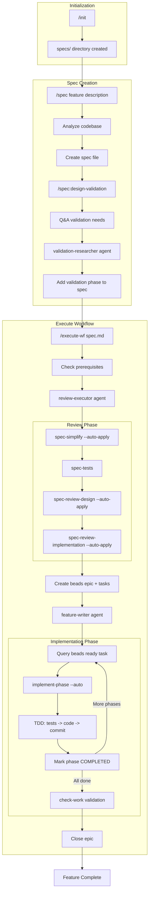
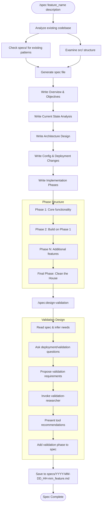
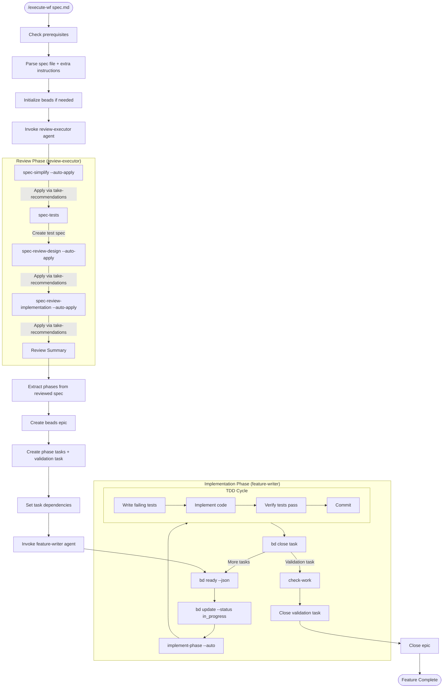
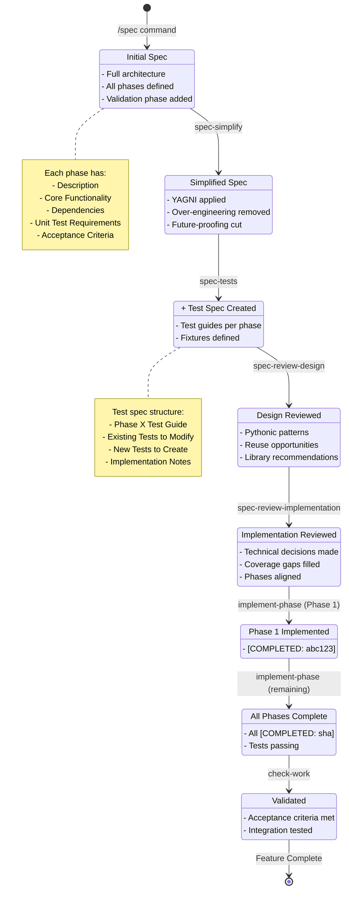

# CC Workflow Tools Research

## Overview

**CC Workflow Tools** is a Claude Code plugin that provides a spec-driven development workflow with Test-Driven Development (TDD) methodology. It implements a structured, opinionated approach to feature development that emphasizes:

1. **Specification-First Development** - Write detailed technical specifications before coding
2. **Review and Simplification** - Apply YAGNI principles and simplify specs before implementation
3. **Test-Driven Development** - Write failing tests first, then implement to make them pass
4. **Phase-Based Implementation** - Break features into incremental, buildable phases
5. **Validation** - Verify acceptance criteria after implementation

The plugin solves the problem of inconsistent feature development by enforcing a rigorous workflow that ensures:
- Clear requirements before coding begins
- Simplified, non-over-engineered solutions
- Comprehensive test coverage
- Trackable progress through beads (issue tracking)
- Consistent patterns across projects

**Key Philosophy:**
- No backward compatibility (unless explicitly required)
- Direct integration into existing code (no parallel systems)
- Simplest solution that works
- Pythonic patterns and standard library usage
- No code samples in specs (conceptual architecture only)

---

## Command Structure

### Main Commands

| Command | Description | Usage |
|---------|-------------|-------|
| `/cc_workflow_tools:spec` | Create a new feature specification | `/spec <feature_name> "<description>"` |
| `/cc_workflow_tools:execute-wf` | Execute complete workflow from spec to implementation | `/execute-wf <spec_file_path>` |
| `/cc_workflow_tools:bug` | Fix a bug using TDD methodology | `/bug <description> [--auto]` |
| `/cc_workflow_tools:fix-tests` | Run tests and fix failures with commit context | `/fix-tests [--limit N]` |
| `/cc_workflow_tools:init` | Initialize project with specs/ directory | `/init` |
| `/cc_workflow_tools:setup-project` | Scaffold new repository with ecosystem integration | `/setup-project [--reference ../repo]` |

### Spec Sub-Commands

| Command | Description |
|---------|-------------|
| `/spec:design-validation` | Q&A-driven validation strategy design for a spec |
| `/spec:build-validation-tool` | Build reusable validation tools in the plugin |

### Execute-WF Sub-Commands

| Command | Description |
|---------|-------------|
| `/execute-wf:spec-simplify` | Apply YAGNI principles to simplify specs |
| `/execute-wf:spec-tests` | Generate test specifications from spec |
| `/execute-wf:spec-review-design` | Review design patterns and architecture |
| `/execute-wf:spec-review-implementation` | Review implementation decisions and clarity |
| `/execute-wf:implement-phase` | Implement a spec phase using TDD |
| `/execute-wf:check-work` | Validate acceptance criteria |
| `/execute-wf:take-recommendations` | Apply specific review recommendations by section |

---

## Workflow 1: Spec Creation (/spec)

The `/spec` command creates comprehensive technical specifications that serve as the foundation for implementation.

### Flow

1. **Codebase Analysis**
   - Examines existing project structure
   - Reviews existing specs in `specs/` directory
   - Identifies patterns to follow

2. **Specification Creation**
   - Generates spec file: `specs/YYYY-MM-DD_HH-mm_<feature_name>.md`
   - Includes:
     - Overview & Objectives
     - Current State Analysis
     - Architecture Design (no code, mermaid diagrams)
     - Configuration & Deployment Changes
     - Implementation Phases with acceptance criteria

3. **Phase Structure**
   - Each phase follows: Incremental, Buildable, Testable, Measurable
   - Phase headers: `## Phase 1: [Name]` (for command compatibility)
   - Completion markers: `[COMPLETED: git-sha]`
   - Final phase always: "Clean the House" (docs update, dead code removal)

4. **Validation Design**
   - Automatically invokes `/spec:design-validation`
   - Q&A process to define validation requirements
   - Researches validation tools via validation-researcher agent
   - Adds validation phase to spec

### Spec File Structure

```markdown
# Feature Specification

## Overview & Objectives
[Problem statement and goals]

## Current State Analysis
[What exists vs. what's needed]

## Architecture Design
[Conceptual description, mermaid diagrams - NO CODE]

## Configuration & Deployment Changes
- Environment Variables
- Dependencies
- Deployment Files to Update
- Secrets

## Phase 1: [Name]
- Description
- Core Functionality
- Dependencies
- Unit Test Requirements
- Acceptance Criteria

## Phase 2: [Name]
[...]

## Phase N: Clean the House
- Remove dead code
- Update README.md and CLAUDE.md
- Resolve TODOs
```

---

## Workflow 2: Execution (/execute-wf)

The `/execute-wf` command runs the complete automated workflow from reviewed spec to implemented feature.

### Two-Phase Architecture

**Phase 1: Review (review-executor agent)**
- No beads tracking
- Git history tracks decisions
- Outputs: simplified spec, test spec, reviewed specs

**Phase 2: Implementation (feature-writer agent)**
- Uses beads for progress tracking
- Each phase implemented via TDD
- Outputs: working code, passing tests

### Sub-Command Sequence

#### 1. spec-simplify
**Purpose**: Remove unnecessary complexity before implementation

**Checklist Areas:**
- Future-proofing (remove "just in case" features)
- Backward compatibility (remove unless required)
- Testing complexity (simplify mocks, parametrized tests)
- Architecture over-engineering (factories, strategies for 2 options)
- Premature abstraction (base classes with one subclass)
- Configuration bloat (env vars with one valid value)
- Documentation overhead

**Auto-Apply Categories:**
- YAGNI features, premature abstractions
- Test simplifications, config bloat removal
- Following existing patterns

**Needs User Approval:**
- Architectural changes, breaking API changes
- New external dependencies, major refactoring

#### 2. spec-tests
**Purpose**: Create test guides for TDD implementation

**Output**: `specs/tests_YYYY-MM-DD_<feature_name>.md`

**For Each Phase:**
- Existing tests to modify
- New tests to create (with Input/Expected/Covers)
- Test implementation notes

#### 3. spec-review-design (Phase 1)
**Purpose**: Design improvements and architectural alignment

**Sections:**
- Section 1: Simplification Opportunities
- Section 2: Pythonic Improvements
- Section 3: Reuse Opportunities
- Section 4: Recommended Libraries

#### 4. spec-review-implementation (Phase 2)
**Purpose**: Implementation clarity and technical decisions

**Format**: Table with Options, Benefits, Tradeoffs, Complexity

**Sections** (continuing numbering): 5, 6, 7...
- Implementation questions requiring decisions
- Test coverage gaps
- Phase alignment verification

#### 5. take-recommendations
**Purpose**: Apply specific recommendations from reviews

**Usage**: `/execute-wf:take-recommendations sections: 1, 3, 5`

**Process**:
- For each section: apply to spec, apply to test spec, git commit
- Commit message: "Apply spec review recommendation from section X"

#### 6. implement-phase
**Purpose**: TDD-based phase implementation

**7-Step Pattern Per Phase:**
1. Phase Review & Alignment
2. Write Tests First (red)
3. Implement Code (green)
4. Commit Implementation
5. Validate Acceptance Criteria
6. Phase Completion Review
7. Update Specification (mark `[COMPLETED: git-sha]`)

**Modes:**
- Interactive: Waits for approval at each step
- Auto (`--auto`): Proceeds without pausing

#### 7. check-work
**Purpose**: Validate implementation against acceptance criteria

**Analysis Phases:**
1. Implementation Analysis (git history, code changes)
2. Acceptance Criteria Assessment (checklist, completion score)
3. Integration Test Coverage Analysis
4. Test Execution & Auto-Fix
5. Final Recommendations (continue, file bugs, or complete)

---

## Agents

### spec-writer
**Model**: Opus (green)
**Role**: Creates technical specifications from architectural designs

**Responsibilities:**
- Transform architecture into actionable specs
- Break implementation into minimal phases
- Ensure alignment with project principles
- Follow naming conventions for `/implement-phase` compatibility

**Invoked By:**
- `/spec` command
- Complex bugs requiring redesign
- Explicit requests

---

### validation-researcher
**Model**: Sonnet (yellow)
**Role**: Research validation tools and strategies

**Responsibilities:**
- Read validation-expert skill for known methods
- Discover MCP servers in current session
- Auto-discover project tools (npm, Python, CI/CD)
- Trace data flow through systems
- Design E2E validation scenarios
- Return structured recommendations

**Key Capability**: Multi-tool orchestration for true E2E validation using real data

---

### feature-architect
**Model**: Opus (cyan)
**Role**: Feature feasibility analysis and solution design

**Responsibilities:**
- Architecture analysis (patterns, stack, boundaries)
- Documentation discovery (CLAUDE.md, docs/)
- Solution development (2-4 options)
- Trade-off analysis
- Interactive refinement with user

**Output**: Options with pros/cons, recommended solution, implementation roadmap

---

### review-executor
**Model**: Sonnet (purple)
**Role**: Orchestrates the spec review phase

**Execution Pattern:**
1. Track git starting point
2. Execute spec-simplify with --auto-apply
3. Execute spec-tests
4. Execute spec-review-design with --auto-apply
5. Execute spec-review-implementation with --auto-apply
6. Generate comprehensive summary

**Key Feature**: Intelligent filtering - auto-applies safe recommendations, pauses for architectural decisions

---

### tests-writer
**Model**: Opus (pink)
**Role**: Comprehensive test generation following TDD

**Critical First Step**: Check for repository-specific test documentation in `/tests`

**Process:**
1. Check repository test docs
2. Analyze code
3. Identify test scenarios
4. Design fixtures
5. Write unit tests
6. Write integration tests
7. Add markers
8. Verify coverage

**Test Quality Standards:**
- One behavior per test
- Fixtures for common setup
- No test interdependencies
- Mock at boundaries
- Assert specific values

---

### feature-writer
**Model**: Sonnet (blue)
**Role**: Implements feature phases from reviewed specs

**Execution Model**: Internal loop processing all phases in single invocation

**Workflow:**
1. Query beads for next ready task
2. Route to appropriate command based on task title
3. Update beads task status
4. Continue loop until epic closed

**Task Routing:**
- "Phase N: ..." -> `/execute-wf:implement-phase --auto`
- "Validation" -> `/execute-wf:check-work`

**Termination:**
- SUCCESS: All tasks closed, epic closed
- FAILURE: Phase fails or requires user intervention

---

## Key Artifacts

### Specification Files

**Location**: `specs/`

**Naming**: `YYYY-MM-DD_HH-mm_<feature_name>.md`

**Evolution**:
1. Created by `/spec` - initial comprehensive spec
2. Simplified by `spec-simplify` - YAGNI applied
3. Enhanced by `spec-review-design` - Pythonic improvements
4. Clarified by `spec-review-implementation` - decisions made
5. Marked complete by `implement-phase` - `[COMPLETED: sha]` added

### Test Specification Files

**Location**: `specs/`

**Naming**: `tests_YYYY-MM-DD_<feature_name>.md`

**Created By**: `spec-tests`

**Contains**:
- Test guides per phase
- Existing tests to modify
- New tests to create
- Fixtures and mocks needed

### Beads (Issue Tracking)

**Used During**: Implementation phase only

**Structure**:
- Epic: "Feature: [feature_name]"
- Tasks: "Phase N: [phase_name]"
- Final Task: "Validation - check-work"

**Dependencies**: Phase N blocks Phase N+1; Last phase blocks Validation

### Git History

**Used For**: Tracking review decisions

**Commit Patterns**:
- "Apply spec review recommendation from section X"
- Phase commits with TDD markers
- Spec completion markers

---

## Mermaid Diagrams

### Full Pipeline



### Spec Creation Flow



### Execution Flow



### Spec File Evolution



---

## Skills

### validation-expert
**Purpose**: Expert at designing validation strategies for deployments

**Knowledge Areas:**
- Universal tools (pytest, jest, gh, curl, httpx)
- MCP servers (Playwright, Supabase, GitHub, Filesystem)
- Deployment-specific patterns (Cloud, GitHub Actions, CLI, API)
- E2E validation patterns with real data
- Tool discovery methods

**Key Capability**: Multi-tool orchestration for true end-to-end validation

### project-setup-expert
**Purpose**: Expert at setting up new repositories in existing ecosystems

**Knowledge Areas:**
- Reference repository analysis
- Project scaffolding (src/, tests/, pyproject.toml)
- Ecosystem integration (plugins, symlinks, CLAUDE.md)
- Project type variations (FastAPI, CLI, Actions, Library)

**Templates Provided:**
- CLAUDE.md structure
- Expert skill template
- Makefile template
- pyproject.toml patterns

---

## Shared Documentation

### PATTERNS.md
**Location**: `plugins/cc_workflow_tools/shared_docs/PATTERNS.md`

**Purpose**: Codifies development patterns for consistency

**Checklist Categories:**
- Architectural Patterns (direct integration, no backward compat, module structure)
- Development Patterns (TDD, phase-based, Makefile, uv)
- Test Patterns (organization, markers, mocks, naming)
- Code Quality Patterns (type annotations, dataclasses, error handling)
- Documentation Patterns (CLAUDE.md, docstrings, specs)

**Pattern Violation Response:**
1. Flag the violation
2. Explain the conflict
3. Suggest alternatives
4. Present case for pattern evolution if needed
5. Get user decision before proceeding
